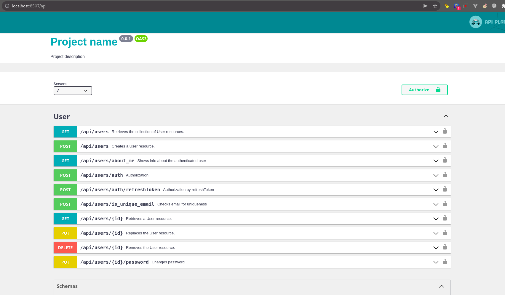

## Installation

Download the project<br>
```https://github.com/ARDevphp/yangiliklar-uz.ru.git```

Go to the project directory<br>
```cd name_folder```

Run docker containers <br>
```docker compose up -d```

Install composer scripts:<br>
```docker compose exec php composer install```

To install project run command:<br>
```docker compose exec php bin/console ask:install```

**Done! You can open <a href="http://localhost:8507/api" target="_blank">http://localhost:8507/api</a> via browser. 
By the way, you can change this port by changing ```DOCKER_NGINX_PORT``` variable in [.env](.env) file.** 

